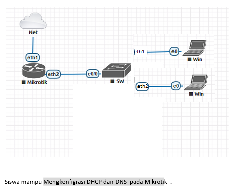

# LAB-15-DHCP-DNS-INTERNET
tanggal 14 agustus 2025
# konfigurasi DHCP dan DNS pada mikrotik

1. masuk ke mikrotik via winbox pilih  
   menu: IP > DHCP CLIENT  
   klik tanda +  
   Setting DHCP Client agar Mikrotik terhubung ke intrnet melalui ether1 yang terhubung ke ISP.  

2. buat ip static buat ether2 di  
   menu: IP > Address  
   klik +  
   seting address untuk interface ether2  

3. membagikan IP ke client secara otomatis.  
   menu: IP > DHCP server > DHCP setup  
   lalu klik next hingga selesai  
   

4. Setting DNS, masukan DNS google.  
   menu: IP > DNS  

5. Setting IP Firewall NAT agar client bisa mengakses ke internet.  
   menu: IP > Firewall > NAT  
   pilih menu sesui gambar di bawah   

6. Pindah ke PC Client untuk setting  obtain auto di IPv4.    

7. pengujian dengan cara cek detail di laptop client.
         
Laptop 1  

Laptop 2  

# kesimpulan
Dengan DHCP Server, pembagian alamat IP, gateway, dan DNS ke perangkat klien dilakukan secara otomatis, sehingga meminimalkan kesalahan konfigurasi manual dan menghemat waktu.  

   
